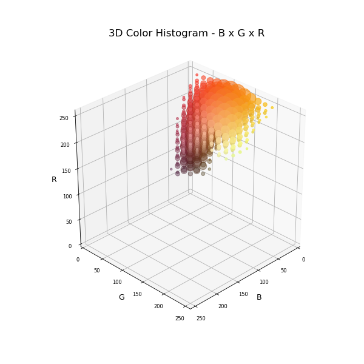
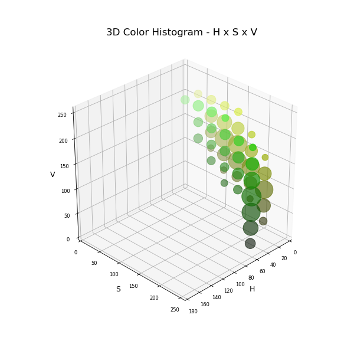

# Color Predicate
A Python script to easily build Color Predicates from multidimensional gaussian smoothed color histograms, a powerful tool for color-based image segmentation.

A Color Predicate (CP), as explained in [1], is a histogram-like structure, "a binary-valued tessellation of color space where cells are labeled as either a member of the desired range of colors or not". It could also be described as a color look-up table [2] meant to translate the colors of a desired target to a binary mask.

In order to build an efficient Color Predicate, color data should be sufficient to comprise most of the target's color range, which is not always possible. Kjeldsen and Kender comment on this, proposing a solution: "If it were possible to get perfect training data, a straight forward histogram and threshold of the pixels in the training region would create a good color predicate. Unfortunately the training data is seldom perfect, and our first experiments using only positive training examples produced very poor results, primarily due to false positive regions in the CP. Attempts to clean these up with a higher threshold resulted in false negative regions being created. Adding negative training examples and Gaussian smoothing [...] improved results dramatically" [1].

The method proposed in [1] aims at reducing the gaps of a deficient dataset. By adding gaussian distributions centered at pixels' locations, instead of simply counting the pixels, the authors were able to fill in pixels that were likely ommited due to limitations on obtaining the dataset. Besides gaussian smoothing, it is also suggested that, upon constructing the histogram, negative training examples (pixels in the background) be considered: whereas positive examples increase cell counts, "pixels in the background decrease cell counts, but use a smaller and narrower Gaussian distribution. The result is a 'histogram' of the training images containing both positive and negative values" [1]. Finally, the Color Predicate is obtained by thresholding the histogram by an experimental value.

# Usage

This script is meant to help on the creation of a Color Predicate for further use on applications requiring color-based segmentation. As input, the user should provide, at least, a set of images containing the target areas. When binary masks are included, background areas are taken as negative training examples.

| Example 1 - Fire Color Histogram | Example 2 - Grass Color Histogram |
| ---------------- | ----------------- |
|  |  |

# References

[1] KJELDSEN, R.; KENDER, J.. Finding skin in color images. Proceedings Of The Second International Conference On Automatic Face And Gesture Recognition, [s.l.], p.312-317, 1996. IEEE Comput. Soc. Press. http://dx.doi.org/10.1109/afgr.1996.557283

[2] PHILLIPS, W.; SHAH, M.; LOBO, N. da Vitoria. Flame recognition in video. Proceedings Fifth Ieee Workshop On Applications Of Computer Vision, [s.l.], p.224-229, 2000. IEEE Comput. Soc. http://dx.doi.org/10.1109/wacv.2000.895426
